<p align="center">
  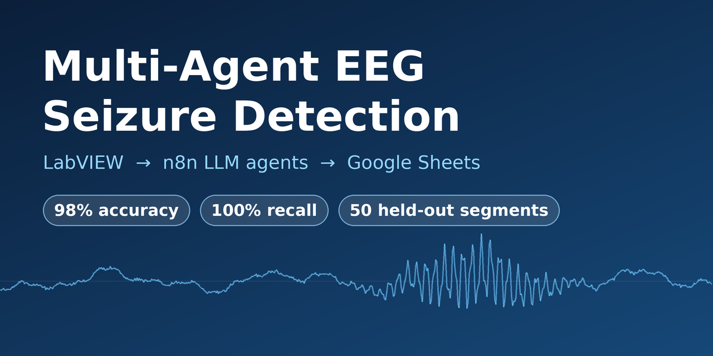
</p>

<h1 align="center">Multi-Agent EEG Seizure Detection</h1>

<p align="center">
  <b>LabVIEW × n8n × LLM agents × Google Sheets</b><br>
  An end-to-end pipeline that classifies one-second EEG segments, decides what to do about them, and logs every decision with a written justification.
</p>

<p align="center">
  
  
  
  
  
  
  
</p>

> **Research and teaching prototype. This is not a medical device and it has not been clinically validated.**

<p align="center">
  <a href="#background">Background</a> ·
  <a href="#results">Results</a> ·
  <a href="#architecture">Architecture</a> ·
  <a href="#how-it-works">How it works</a> ·
  <a href="#tech-stack">Tech stack</a> ·
  <a href="#screenshots">Screenshots</a> ·
  <a href="#getting-started">Getting started</a>
</p>

---

## Background

Epilepsy is a chronic neurological disease in which excessive electrical discharges in groups of brain cells cause seizures. The World Health Organization estimates that around 50 million people live with it, nearly 80 % of them in low- and middle-income countries, and that up to 70 % could be seizure-free with proper diagnosis and treatment ([WHO fact sheet](https://www.who.int/news-room/fact-sheets/detail/epilepsy)).

The electroencephalogram (EEG) records this electrical activity, and an abnormal EEG pattern is one of the most consistent predictors of seizure recurrence. But reading long recordings by eye is slow and needs a specialist, which is where automation can help.

## Why this project

This project explores how far a lightweight, transparent chain can go: classic signal features computed in LabVIEW, a calibrated score as an anchor, LLM agents that classify, write a short report and choose an action, and a dashboard that keeps the justification of every decision.

---

## Highlights

- **Complete chain.** Signal features in LabVIEW, an HTTP call to an n8n workflow with three LLM agents, an alert email, and a live Google Sheets dashboard.
- **Grounded LLM reasoning.** A deterministic likelihood score, calibrated on 200 labelled segments, is given to the classifier agent. Used alone, its threshold of 2.3 already reaches 85 % accuracy on the calibration set.
- **Measured, not claimed.** On 50 held-out segments (disjoint from the calibration set): **98 % accuracy, 100 % recall (no missed seizure), 1 false alarm**, with 95 % Wilson confidence intervals.
- **Auditable decisions.** Explicit rules map classification and confidence to an action, and every row of the journal keeps the agent's justification.
- **Reproducible.** Data subsets (seed 42), scripts, the exported workflow (secrets removed), the evaluation journal and the metrics are all in this repository.

## Try it without LabVIEW

If you only have n8n running (see [Getting started](#getting-started)), you can send one segment's features by hand:

```bash
curl -X POST http://127.0.0.1:5678/webhook/eeg-crise \
  -H "Content-Type: application/json" \
  -d '{"segment_id":8861,"energie_rms":210.3245,"entropie_spectrale":0.4992,"frequence_dominante_hz":3.90,"label_reel":"CRISE"}'
```

The workflow scores the segment, runs the three agents, and writes one row to the dashboard. Field names are in French (`energie_rms`, `label_reel`), and the labels are `CRISE` (seizure) and `NON_CRISE` (no seizure).

## Results

Evaluation on the 50 held-out segments (25 seizure, 25 non-seizure). Seizure is the positive class.

| Metric | Value | 95 % CI (Wilson) |
|---|---|---|
| Accuracy | 98.00 % | 89.50 % – 99.65 % |
| Precision | 96.15 % | 81.11 % – 99.32 % |
| Recall | 100 % | 86.68 % – 100 % |
| F1-score | 98.04 % | not computed |

<p align="center">
  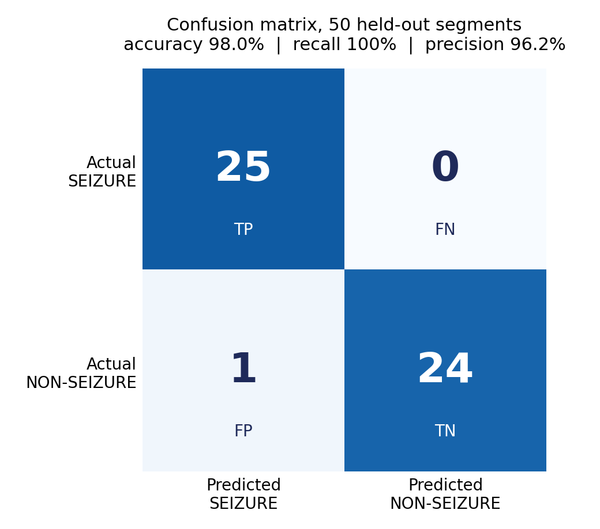
</p>

The single error is segment 9752 (true class NON_CRISE, predicted CRISE with confidence 0.86). Its features (RMS 179.5, spectral entropy 0.3675) give a likelihood score of 3.8, above the 2.3 threshold, so the pipeline raised a false alarm rather than missing a seizure.

With 50 segments the intervals are wide (the lower bound of the recall is 86.7 %). These numbers show that the approach works on this benchmark. They are not clinical evidence.

## Architecture

<p align="center">
  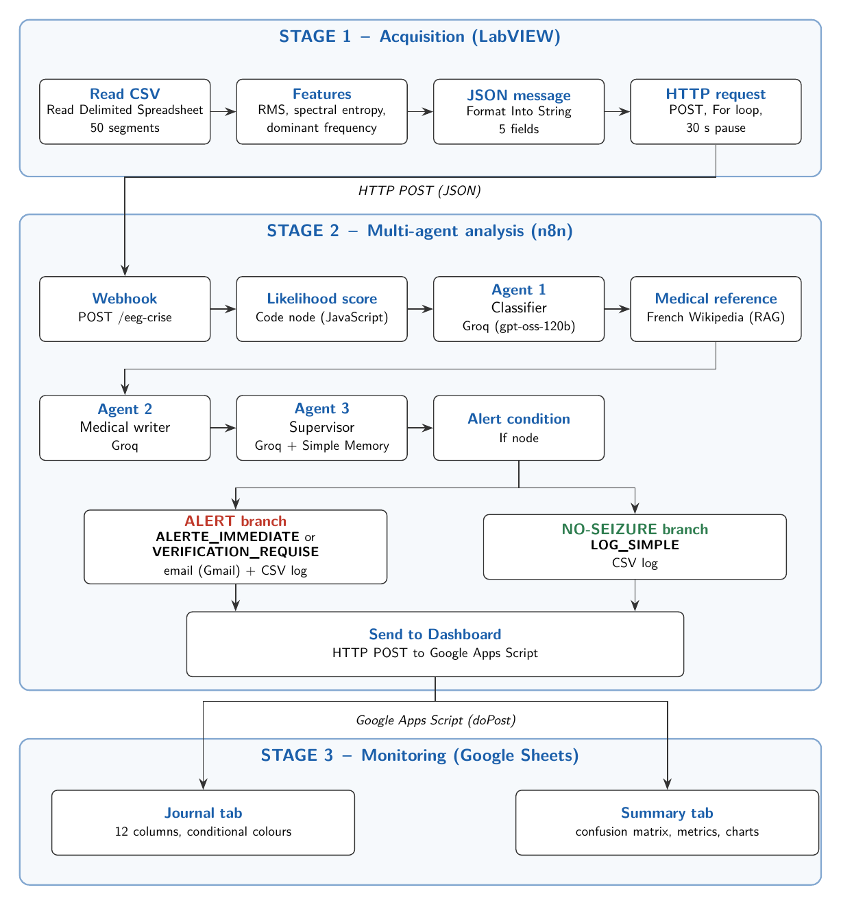
</p>

1. **Acquisition (LabVIEW).** One VI reads the segments, computes three features, builds a JSON message and POSTs it to n8n, one segment every 30 s.
2. **Analysis (n8n).** A Code node computes the likelihood score. Agent 1 classifies, a Wikipedia lookup gives Agent 2 a medical reference for its report, and Agent 3 chooses the action.
3. **Monitoring (Google Sheets).** An Apps Script endpoint appends each result to a colour-coded journal, and a summary tab computes the confusion matrix and metrics live.

## How it works

### 1. Features (LabVIEW)

For each segment of $n = 178$ samples at $f_s = 173.61$ Hz:

- **RMS energy:** $E_{RMS} = \sqrt{\tfrac{1}{n}\sum_i x_i^2}$
- **Normalised spectral entropy:** with the one-sided power spectrum $P_k$ ($N = 90$ bins) and $p_k = P_k / \sum_j P_j$, $H = -\dfrac{1}{\log_2 N}\sum_k p_k \log_2(p_k + \varepsilon)$, where $\varepsilon = 10^{-12}$
- **Dominant frequency:** $f_{dom} = k^{*} \cdot f_s / n$, where $k^{*}$ is the index of the spectral peak (excluding index 0)

The LabVIEW implementation matches a NumPy/pandas reference within 1 %.

### 2. Likelihood score (n8n Code node)

$$s = \min\!\left(\frac{E_{RMS}}{100}\cdot\frac{1}{H + 0.01}\cdot g(f_{dom}),\ 10\right), \qquad g(f) = \begin{cases}1.2 & 3 < f < 30\ \text{Hz}\\ 0.8 & \text{otherwise}\end{cases}$$

Calibrated on 200 labelled segments: mean score 5.60 (seizure) vs 1.69 (non-seizure), and an optimal threshold of **2.3**. The calibration sentence is part of Agent 1's system prompt.

<p align="center">
  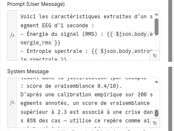<br>
  <sub>Agent 1's prompt in n8n, including the calibration sentence.</sub>
</p>

### 3. The three agents

All agents use `openai/gpt-oss-120b` on Groq at temperature 0, with structured-output parsers.

| Agent | Role | Output |
|---|---|---|
| 1 · Classifier | Classifies the segment from the three features and the score | classification, confidence (0 to 1), justification |
| 2 · Medical writer | Writes a short clinical report, with a mention of the Wikipedia reference | report text |
| 3 · Decision supervisor | Chooses the action (5-interaction memory) | `ALERTE_IMMEDIATE`, `VERIFICATION_REQUISE` or `LOG_SIMPLE` |

### 4. Decision rules (Agent 3)

| Condition | Action | Effect |
|---|---|---|
| seizure and confidence ≥ 0.7 | `ALERTE_IMMEDIATE` | alert without delay: email + log |
| seizure and confidence < 0.7 | `VERIFICATION_REQUISE` | suspected seizure, too uncertain to alert: human check, email + log |
| no seizure | `LOG_SIMPLE` | log only |

### 5. Dashboard

Every segment becomes one row of a 12-column journal: timestamp, `segment_id`, the three features, the likelihood score, true label, classification, confidence, action, prompt version, and the agent's justification. Classification and action are colour-coded.

## Tech stack

| Layer | Tools |
|---|---|
| Acquisition and signal processing | LabVIEW Community Edition (FFT, native HTTP client) |
| Orchestration | n8n 2.38 (self-hosted in Docker), webhook trigger |
| LLM agents | Groq API, `openai/gpt-oss-120b`, temperature 0, structured-output parsers, 5-interaction memory on the supervisor |
| Retrieval | French Wikipedia (medical reference for the report writer) |
| Monitoring | Google Sheets and Google Apps Script |
| Alerting | SMTP e-mail |
| Evaluation | Python 3.10, pandas, NumPy |

## Screenshots

**n8n workflow**

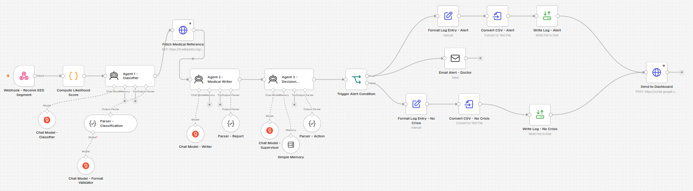

<table>
  <tr>
    <td width="50%">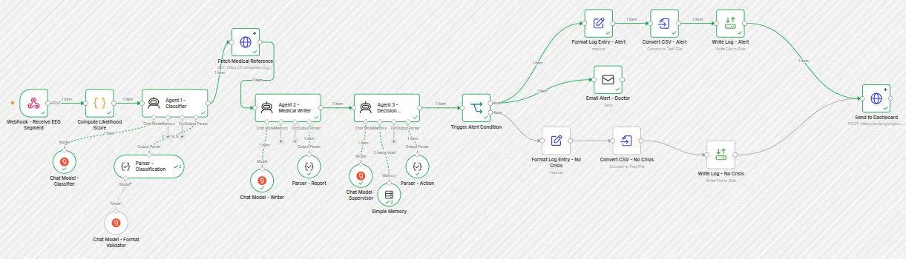<br><sub>Execution: alert branch</sub></td>
    <td width="50%">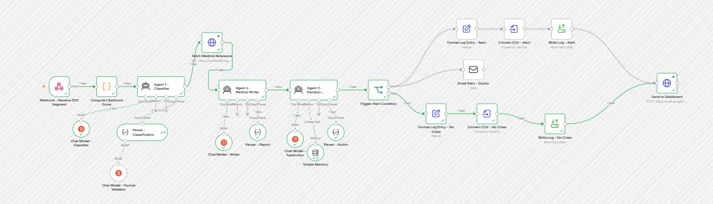<br><sub>Execution: no-seizure branch</sub></td>
  </tr>
</table>

**The three agents** (model, memory, tools, output parser)

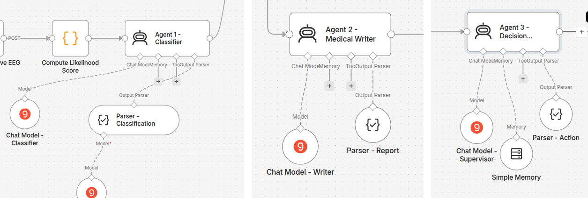

**LabVIEW**

<table>
  <tr>
    <td width="50%">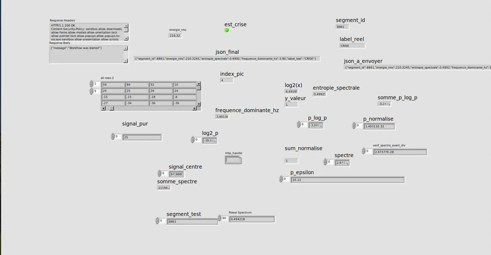<br><sub>Front panel during a run</sub></td>
    <td width="50%">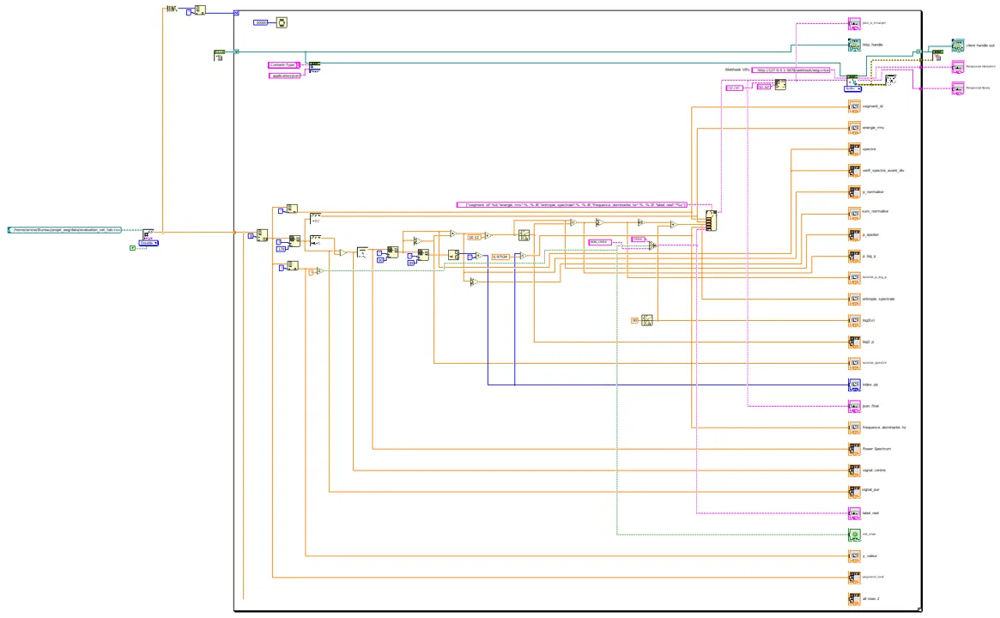<br><sub>Block diagram (overview)</sub></td>
  </tr>
</table>

**Dashboard and alerts**

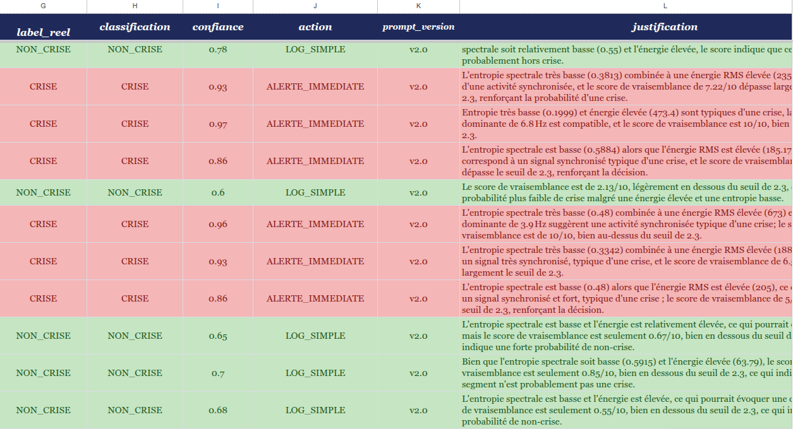

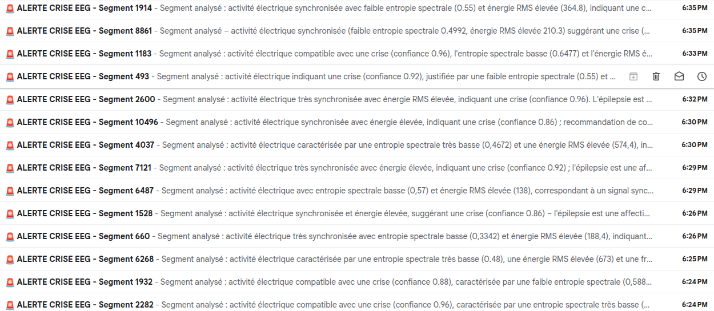

## Repository structure

```text
.
├── README.md
├── LICENSE
├── CITATION.cff
├── requirements.txt
├── labview/
│   └── EEG_Main.vi              # acquisition, features, HTTP client
├── n8n/
│   └── workflow.json            # exported workflow (credentials and URLs removed)
├── dashboard/
│   └── Code.gs                  # Google Apps Script: doPost + sheet formatting
├── data/                        # 250-segment subsets used in the study
├── scripts/
│   ├── prepare_datasets.py      # draws the subsets (seed 42)
│   ├── calibrate_score.py       # score statistics and threshold on the calibration set
│   └── compute_metrics.py       # confusion matrix, metrics, Wilson intervals
├── evaluation/
│   ├── journal.csv              # the 50 evaluated segments, with justifications
│   └── metrics.json
└── docs/
    └── images/                  # figures used in this README
```

## Getting started

**You need:** Docker, a free [Groq](https://groq.com) API key, a Google account, an SMTP account for the alert email, Python 3.10, and (for the full chain) LabVIEW Community Edition.

1. **Clone.**
   ```bash
   git clone https://github.com/Amine-Riahi26-max/eeg-seizure-detection-multi-agent.git
   cd eeg-seizure-detection-multi-agent
   ```
2. **Start n8n.**
   ```bash
   docker volume create n8n_data
   docker run -it --rm --name n8n -p 5678:5678 -v n8n_data:/home/node/.n8n docker.n8n.io/n8nio/n8n
   ```
3. **Import and configure the workflow.** Import `n8n/workflow.json`, then follow [`n8n/README.md`](n8n/README.md): add a Groq credential and an SMTP credential, set the sender and recipient emails, and publish the workflow.
4. **Create the dashboard.** Follow [`dashboard/README.md`](dashboard/README.md), then paste the web-app URL into the `Send to Dashboard` node.
5. **Send data.** Either use the `curl` example above, or open [`labview/EEG_Main.vi`](labview/README.md) and run it once on `data/evaluation_set_tab.csv`.
6. **Compute the metrics.** After the run (about 25 minutes for 50 segments), export the journal tab as CSV and run:
   ```bash
   pip install -r requirements.txt
   cd evaluation
   python ../scripts/compute_metrics.py journal.csv
   ```

## Engineering notes

- **Free-tier rate limits.** At the time of the experiment, Groq's free tier allowed 30 requests/min and 8,000 tokens/min, and each segment costs about 3,000 tokens over three agent calls. A 30 s pause between segments keeps the pipeline under those limits. n8n's automatic *Retry On Fail* is turned off on the three agents, because it looped on quota errors.
- **Decimal comma in LabVIEW.** With a French locale, `Format Into String` writes `0,4992` and the JSON becomes invalid. The `;` modifier before each float specifier (`%.;%.4f`) forces a decimal point.
- **Use `127.0.0.1`, not `localhost`.** `localhost` resolved to IPv6 and failed on the test machine.
- **Run the VI once, never in continuous mode.** Continuous runs left HTTP handles open until LabVIEW ran out of memory.

## Roadmap

- Evaluate on larger and more realistic datasets (for example CHB-MIT).
- Replace file reading with live acquisition.
- Add an independent auditor agent that checks the supervisor.
- Tune the confidence thresholds and compare against a classical machine-learning baseline.

## Data and attribution

The signals come from the *Epileptic Seizure Recognition* dataset, a re-segmented version of the Bonn University EEG database: 11,500 one-second segments of 178 samples ($f_s$ = 173.61 Hz) in five classes (1 = seizure activity, 2 to 5 = non-seizure). Here classes 2 to 5 are merged into `NON_CRISE`.

> Andrzejak RG, Lehnertz K, Mormann F, Rieke C, David P, Elger CE. *Indications of nonlinear deterministic and finite-dimensional structures in time series of brain electrical activity: Dependence on recording region and brain state.* Physical Review E 64, 061907 (2001).

Only a 250-segment subset (200 for calibration, 50 for evaluation) is included here for reproducibility. The original data remains subject to its providers' terms: check them before reuse. The MIT license below applies to the code, not to the data.

## What this project demonstrates

- **Instrumentation and signal processing:** feature extraction in LabVIEW (RMS, FFT-based spectral entropy, dominant frequency), validated against a Python reference.
- **System integration:** LabVIEW, HTTP/JSON, n8n, Google Apps Script and Sheets, with error handling and rate-limit management.
- **LLM engineering:** multi-agent orchestration with structured outputs, memory, a retrieval step and explicit decision rules around the model.
- **Evaluation discipline:** disjoint calibration and test sets, fixed seed, confusion matrix, Wilson confidence intervals, and an honest statement of the sample size.
- **Documentation:** a reproducible repository with architecture figures and a setup guide in every folder.

## Citation

If you use this work, please cite it (see also [`CITATION.cff`](CITATION.cff)):

```bibtex
@software{riahi2026eeg,
  author = {Riahi, Amine},
  title  = {Multi-Agent EEG Seizure Detection: LabVIEW, n8n and LLM agents},
  year   = {2026},
  url    = {https://github.com/Amine-Riahi26-max/eeg-seizure-detection-multi-agent}
}
```

## License

Code: [MIT](LICENSE).

## Author

**Amine Riahi**, Electrical Engineering student at ENSIT (École Nationale Supérieure d'Ingénieurs de Tunis).
[GitHub](https://github.com/Amine-Riahi26-max)

If this project is useful to you, a ⭐ on the repository is very welcome.
